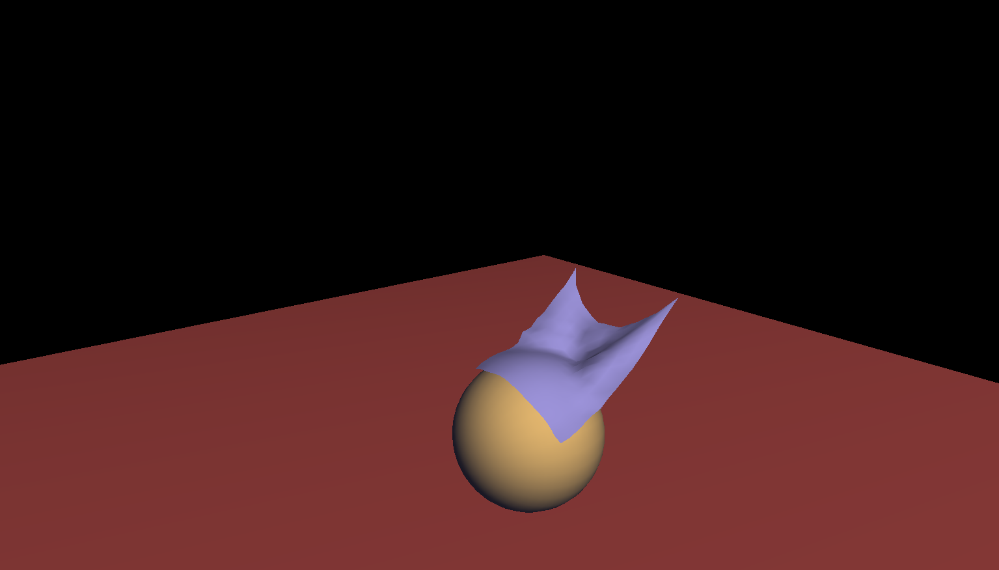

FabricSimulator
===============

Simulates cloth using the physics of springs

Scott Wiedemann

07/05/2013

#Compile It

Depends on openGL headers.  On debian based systems:
sudo apt-get install mesa-common-dev
sudo apt-get install libglu1-mesa-dev
sudo apt-get install freeglut3-dev

make

#Run It

./FabricSimulator

Usage:
./FabricSimulator [Step Size] [System Size] [Integrator]

Example usage:
./FabricSimulator .04 15 RungeKutta4

#Notes

You need the openGL headers installed.  Tested for linux.  Should compile for both mac and linux.  Check stout for the UI controls.
